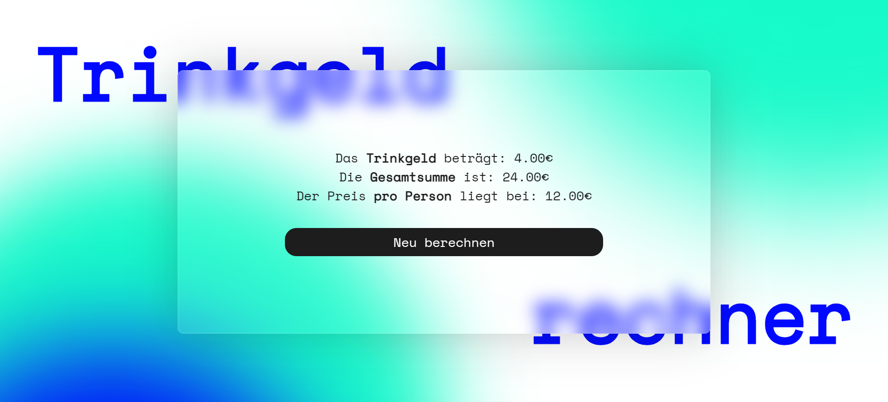

# Project Tips Calculator

  

 

## Table of Contents 📑

- [About](#about)
- [Features](#features)
- [Tech Stack](#tech-stack)
- [Design](#design)

## About

I created this project as a participant of a boot camp for web development focusing on React and Typescript. It was developed on the fourth day of practicing Typescript with Visual Studio Code using HTML, CSS and Typescript.

The goal of this project was to build our first functional project using Typescript functions. This project means to calculate a fair tip depending on the quality of service, total bill and amount of people sharing it.

## Features
<ul>
    <li><b>Inputs for calculation:</b>
      <ul>
        <li>Total sum of the bill</li>
        <li>Amount of people sharing the bill</li>
        <li>Quality of service
          <ul>
            <li>Great service: factor 2% </li>
            <li>Alright service: factor 10% </li>
            <li>Bad service: factor 20%</li>
          </ul>
        </li>
      </ul>
    </li>
    <li><b>Calculation operation:</b>
      <ul>
        <li><b>Tips:</b> total sum * quality of service</li>
        <li><b>Total plus tips:</b> total sum + tips</li>
        <li><b>Price per person:</b> total plus tips / amount of people</li>
      </ul>
    </li>
    <li><b>Dynamic design</b>
      <ul>
        <li>Slide in animation to result</li>
        <li>New calculation option</li>
        <li>Animated background</li>
      </ul>
    </li>
</ul>

## Tech Stack

**Markup:**  
  
**Styling:**  
  
**Programming language:**  
  
**IDE:**  
  
**Version Control:**  
  

## Design

The design featuring the vibrant coloured and circular gradients is inspired by <a href="https://de.pinterest.com/pin/682999099774996286/" title="Sebastian Vigil - Mortgage Calculator">Polina Muromova's "Bricks"</a>. 